# Thought Leadership Crew - AI-Powered Strategic Intelligence System

## 🎯 Overview

The Thought Leadership Crew is an advanced AI agent system that automates strategic intelligence gathering and synthesis for business leaders. This crew monitors trusted news sources, analyzes developments for strategic relevance, and produces executive-ready intelligence digests and social media content.

Built with [CrewAI](https://crewai.com), this system combines multiple specialized AI agents working in concert to transform information overload into actionable strategic insights.

## ✨ Key Features

- **Automated News Intelligence**: Continuously monitors and extracts articles from your configured trusted sources
- **Strategic Relevance Analysis**: AI-powered ranking and filtering based on your specific role and objectives
- **Executive Digest Creation**: Produces scannable, 5-minute intelligence briefings with verified facts and clear implications
- **Social Media Content**: Generates platform-optimized posts to share insights with your network
- **Multi-LLM Support**: Compatible with OpenAI, Anthropic, Google Gemini, Ollama, and more
- **Customizable Intelligence Focus**: Tailor monitoring to your industry, role, and strategic priorities

## 📋 Use Cases

1. **C-Suite Executives**: Stay ahead of industry disruptions and competitive moves with daily intelligence briefings
2. **Strategy Teams**: Track emerging technologies, market shifts, and competitive intelligence systematically
3. **Innovation Leaders**: Monitor breakthrough developments, research advances, and startup activity
4. **Marketing Directors**: Identify trending topics, thought leadership opportunities, and industry narratives

## 🚀 Quick Start

### Prerequisites

- Python >=3.10 <3.14
- [UV](https://docs.astral.sh/uv/) for dependency management

### Installation

1. Install UV if you haven't already:
```bash
pip install uv
```

2. Clone this repository and navigate to the project directory

3. Install dependencies:
```bash
crewai install
```

4. Copy `.env.example` to `.env` and configure your API keys (see Configuration section)

5. Customize your intelligence focus in `knowledge/user_preference.txt`

### Running the Crew

Execute from the project root:
```bash
crewai run
```

The crew will generate:
- `executive_digest.md` - Your strategic intelligence briefing
- `social_media_posts.md` - Ready-to-post social content
- `final_deliverables.md` - Combined output document

## ⚙️ Configuration

### Environment Variables

This crew requires the following environment variables:

1. **Search API** (Required):
   - `SERPER_API_KEY` - For web search capabilities (get from [serper.dev](https://serper.dev))

2. **LLM Configuration** (Required):
   - `LLM_PROVIDER` - Your chosen LLM provider (e.g., openai, anthropic, ollama)
   - `MODEL` - The specific model to use (e.g., gpt-4o, claude-3-5-sonnet-20241022)
   
   The crew combines these as `provider/model` format internally.

3. **Provider API Keys**:
   Set the appropriate API key for your chosen provider according to [CrewAI's LLM documentation](https://docs.crewai.com/en/concepts/llms):
   
   - For OpenAI: `OPENAI_API_KEY`
   - For Anthropic: `ANTHROPIC_API_KEY`
   - For Google: `GEMINI_API_KEY`
   - For Ollama: No API key needed (runs locally)
   
   See full provider list and configuration options at: https://docs.crewai.com/en/concepts/llms

### Customization

#### User Preferences
Edit `knowledge/user_preference.txt` to define:
- Your role and responsibilities
- Strategic objectives and priorities
- Trusted news sources to monitor

#### Agent Configuration
- `src/thought_leadership_crew/config/agents.yaml` - Modify agent roles, goals, and backstories
- `src/thought_leadership_crew/config/tasks.yaml` - Adjust task workflows and outputs

## 📊 Example Output

### Executive Digest Sample
The crew produces comprehensive strategic intelligence briefings including:
- Prioritized developments with relevance scores
- Executive summaries with "why it matters" analysis
- Strategic implications and recommended actions
- Fact-checked statistics and verified sources

### Social Media Posts
Platform-optimized content featuring:
- LinkedIn thought leadership posts
- Twitter/X threads on key developments
- Hashtag strategies for maximum reach

## 🤖 Crew Architecture & Workflow

### The Agents

#### 1. News Collector Agent
- **Role**: Strategic News Intelligence Specialist
- **Mission**: Harvest and extract recent articles from trusted sources
- **Capabilities**:
  - Web search using Serper API
  - Date-aware filtering (focuses on last 24-48 hours)
  - Source reliability assessment
  - Initial relevance filtering
- **Output**: JSON collection of articles with metadata

#### 2. Strategic Analyst Agent  
- **Role**: Strategic Intelligence Analyst
- **Mission**: Analyze and rank collected news based on strategic relevance
- **Capabilities**:
  - Multi-criteria decision analysis (MCDA)
  - Business impact assessment
  - Technology adoption evaluation
  - Competitive intelligence analysis
  - Risk-opportunity scoring
- **Output**: Prioritized list of top 5-10 strategic developments

#### 3. Digest Creator Agent
- **Role**: Executive Intelligence Digest Architect
- **Mission**: Transform analysis into executive-ready intelligence briefing
- **Capabilities**:
  - Fact verification through web search
  - Executive summary writing
  - "Why it matters" contextualization
  - Strategic implications analysis
  - Action item identification
- **Output**: Executive digest markdown file

#### 4. Editorial Publisher Agent
- **Role**: Strategic Communications Specialist
- **Mission**: Create platform-optimized social media content
- **Capabilities**:
  - LinkedIn post generation
  - Twitter/X thread creation
  - Hashtag strategy
  - Engagement optimization
  - Professional tone calibration
- **Output**: Social media posts markdown file

### The Workflow

```mermaid
graph TD
    %% Input
    A[User Input<br/>• User Role<br/>• User Goal<br/>• Trusted Sources] -->|Configures| B[News Collector Agent]
    
    %% News Collection Flow
    B -->|Outputs| NC_OUT[news_collector_output.json<br/>• Article URLs<br/>• Titles & Summaries<br/>• Source metadata]
    NC_OUT -->|Feeds into| C[Strategic Analyst Agent]
    
    %% Analysis Flow
    C -->|Outputs| SA_OUT[analyze_and_select_stories_output.json<br/>• Top 5-10 stories<br/>• Relevance scores<br/>• Strategic rankings]
    
    %% Parallel Processing
    SA_OUT -->|Input for| D{Parallel Execution}
    D -->|Analyzed stories| E[Digest Creator Agent]
    D -->|Analyzed stories| F[Editorial Publisher Agent]
    
    %% Digest Creation
    E -->|Generates| DG_OUT[executive_digest.md<br/>• Executive summaries<br/>• Strategic implications<br/>• Action items]
    
    %% Social Media Creation
    F -->|Generates| SM_OUT[social_media_posts.md<br/>• LinkedIn posts<br/>• Twitter threads<br/>• Hashtag strategies]
    
    %% Final Assembly
    DG_OUT -->|Combined into| G[Final Assembly Task]
    SM_OUT -->|Combined into| G
    G -->|Outputs| FINAL[final_deliverables.md<br/>Complete intelligence package]
    
    %% Styling
    classDef input fill:#e1f5e1,stroke:#4caf50,stroke-width:2px
    classDef agent fill:#e3f2fd,stroke:#2196f3,stroke-width:2px
    classDef output fill:#fff3e0,stroke:#ff9800,stroke-width:2px
    classDef final fill:#fce4ec,stroke:#e91e63,stroke-width:2px
    
    class A input
    class B,C,E,F agent
    class NC_OUT,SA_OUT,DG_OUT,SM_OUT output
    class FINAL final
```



### Task Configuration

The crew executes tasks in a hybrid sequential-parallel pattern:

1. **News Collection Task** (`collect_and_enrich_news`)
   - Searches trusted sources for recent articles
   - Extracts titles, summaries, URLs, and metadata
   - Filters based on initial relevance criteria
   - Output: `news_collector_output.json`

2. **Analysis Task** (`analyze_and_select_stories`)  
   - Applies strategic frameworks to collected news
   - Scores each article on multiple dimensions
   - Ranks by strategic importance
   - Output: `analyze_and_select_stories_output.json`

3. **Parallel Processing** (async_execution=True):
   
   **3a. Digest Creation Task** (`create_executive_digest`)
   - Synthesizes top stories into briefing format
   - Verifies key facts and statistics
   - Adds strategic context and implications
   - Output: `executive_digest.md`
   
   **3b. Social Publishing Task** (`create_social_media_posts`)
   - Transforms analysis into social content
   - Optimizes for platform-specific formats
   - Maintains professional thought leadership tone
   - Output: `social_media_posts.md`

4. **Final Assembly Task** (`compile_final_deliverables`)
   - Waits for both async tasks to complete
   - Combines executive digest and social media posts
   - Creates unified deliverable document
   - Output: `final_deliverables.md`

### Execution Flow Benefits

The parallel execution of digest creation and social media post generation:
- **Enables specialized optimization** for each output format
- **Maintains consistency** through shared analysis data
- **Allows independent fact-checking** and verification

### Customization Points

You can customize the crew's behavior by modifying:

- **Agent Personalities** (`config/agents.yaml`): Adjust roles, goals, and backstories
- **Task Definitions** (`config/tasks.yaml`): Modify task descriptions and expected outputs
- **User Preferences** (`knowledge/user_preference.txt`): Define your specific context:
  ```
  Role: [Your role, e.g., "CTO of a FinTech startup"]
  Objective: [Your goal, e.g., "Stay ahead of AI and blockchain developments"]
  Trusted Sources: [Your preferred news sources]
  ```

## 🛠️ Technical Architecture

### Technology Stack
- **Framework**: CrewAI 0.165.0+
- **Language**: Python 3.10-3.14
- **Package Management**: UV
- **LLM Integration**: Supports all major providers via CrewAI
- **Async Execution**: Parallel task processing for performance

## 📁 Project Structure

```
thought-leadership-crew/
├── src/thought_leadership_crew/
│   ├── config/
│   │   ├── agents.yaml      # Agent definitions
│   │   ├── tasks.yaml       # Task workflows
│   │   └── llm_config.py    # LLM configuration
│   ├── tools/               # Custom tools
│   ├── crew.py             # Crew orchestration
│   └── main.py             # Entry point
├── knowledge/
│   └── user_preference.txt # User configuration
├── docs/
│   └── ollama_setup.md     # Ollama guide
├── .env.example            # Environment template
├── pyproject.toml          # Project metadata
└── README.md              # This file
```

## 🧪 Testing

Run the crew with sample configurations to verify setup:
```bash
# Test with minimal news sources
crewai run

# Validate output quality
cat executive_digest.md
```

## 🤝 Contributing

We welcome contributions! Please feel free to submit issues and pull requests.

## 📄 License

MIT License - See [LICENSE](LICENSE) file for details